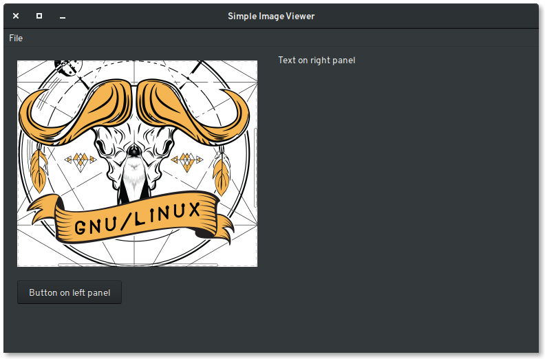

# WxWidgets GUI examples

WxWidgets is a very powerful c++ library/framework for building cross
platform graphic user interfaces. For some reason it's not that widely used
and people in general think it's outdated blast from the past. Lack of
screenshots and tutorials on the internet only adds fuel on that fire.

Let's change that and show some examples of how powerful wxWidgets really is.

## 1. Simple image viewer

Using Global Dark Theme on Gnome3 DE, my demo app integrates nicely using
GTK+3 out of the box.

